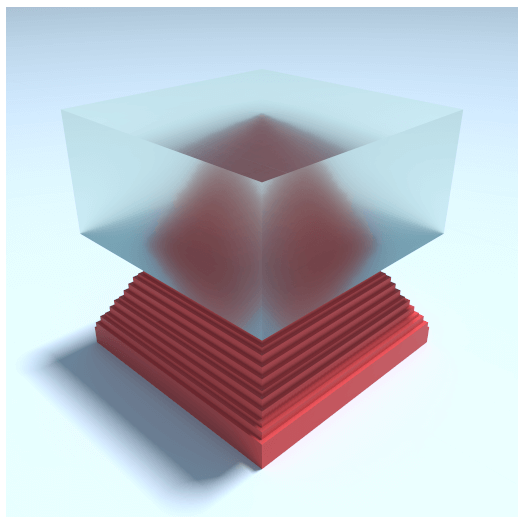
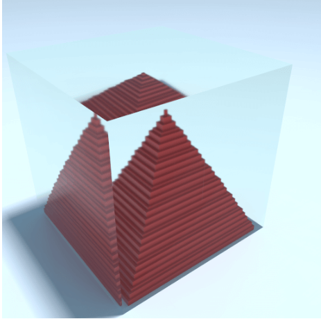
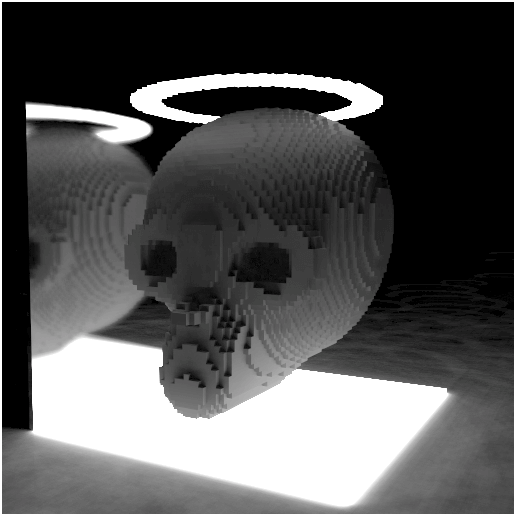

# fast-vixel

## Installation
`npm install fast-vixel`

This is project is base on wwwtyro's [Vixel](https://github.com/wwwtyro/vixel), most of the detail are the same. If you don't konw vixel, you can go checkout [Vixel](https://github.com/wwwtyro/vixel).
But I personally made some changes to the source code and rewritten it with typescript.

The original Vixel render skymap into a Cubic frame buffers which you can roughly think of it as consisting of 6 frambuffers. The idea to spead up skymap rendering is to use one frambuffers instead of a Cubic frame buffers. The trick is to map the 3d position into 2d space, one common method is Paraboloid to Vector Normal.
You may think that the skymap obtained like this will be a bit imperfect, but from the actual results, there is almost no difference between the two.

Other modifications with vixel include changes in texture types. I change the type of tRMET texture form float to uin8, that is one-fourth of original memory cost, and change the format and type of tRi texture from rgba-float to luminance-uint8 which is 1/16th of the original size.

The trade off for compress the texture size is to loss the precision of some value, such as emit and refract. And the rang of the these value will correspondingly different from the counter part in vixel.







open the examples under the ./example folder to see the effect!

## Example
```js
const FastVixel = require('./build/FastVixel');
const canvas = document.createElement('canvas');

canvas.width = 512;
canvas.height = 512;
document.body.appendChild(canvas);

// the canvas is optional, regl will create a default full screen canvas if you don't pass it one.
const fvixel = new FastVixel({canvas:canvas, size:[64, 64, 64]});

// notice it is setCamera, and all 4 params are optional 
fvixel.setCamera({
    eye: [10, 10, 10], // Camera position
    center: [0.5, 0.5, 0.5], // Camera target
    up: [0, 1, 0], // Up
    fov: Math.PI / 4 // Field of view
});

fvixel.set( 1, 0, 0, {
    red: 1,
    green: 0.1,
    blue: 0.1,
});
fvixel.set( 0, 0, 1, {
    red: 1,
    green: 0.1,
    blue: 0.1,
});
fvixel.set(0, 0, 0, {
    red: 1,
    green: 0.5,
    blue: 0.25,
});

// you can take the regl object for other use
fvixel.regl.frame(() => {
    fvixel.sample(1);
    fvixel.display();
});
// you can also replace the `fvixel.regl.frame`
// with requestanimationframe like this:
/**
 * 
function render() {  
    fvixel.sample(1);
    fvixel.display();
    window.requestAnimationFrame(render); 
}
window.requestAnimationFrame(render);
 */
```

## API

`const FastVixel = require('fast-vixel')`

### Constructor

```js
const fvixel = new FastVixel(opt:{canvas?, size:number[]|vec3} = {size:[32, 32, 32]});
```
similar to vixel's constructor, except the param is an object, the canvas is optional and the default world size is [32, 32, 32]
### Method
Like vixel, methods marked with an (*) will reset the renderer. This will clear the collected samples and require new samples to converge the scene. Methods marked with (**) will reset both the renderer and require the voxel data to be reuploaded to the GPU on the next call to fvixel.sample. Reuploading can be slow depending on world size and the total amount of voxel.

`fvixel.set(x, y, z, options)**`

sets a voxel at coordinates `x, y, z` with options, similar to vixel.set(x, y, z, options), except some options' attributes have **different range**:
##### `options`

| Option      | Type  | Default | Description                                                                                                              |
| ----------- | ----- | ------- | ------------------------------------------------------------------------------------------------------------------------ |
| red         | float | 1.0     | The red component of the voxel color.                                                                                    |
| green       | float | 1.0     | The green component of the voxel color.                                                                                  |
| blue        | float | 1.0     | The blue component of the voxel color.                                                                                   |
| rough       | **Uint8** | **255**     | The roughness of the voxel surface. Zero is perfectly smooth, 255 is completely rough.                                   |
| metal       | **Uint8** | 0     | The metalness of the voxel surface. Zero is completely nonmetallic, 255 is fully metallic.                               |
| transparent | **Uint8** | 0     | The transparency of the voxel. Zero is completely opaque, 255 is completely clear.                                       |
| refract     | **Uint8** | 85     | The refraction index of the voxel. This value will mapping from **[0, 255] to [0, 3]** in shader, so 85 will be convert to 1. And air has a value of 1.0 * 85 and glass is around 1.333 * 85 => 113. Although some materials have a refractive index greater than 3, common materials are basically within 3.                                   |
| emit        | **Uint8** | 0     | The amount of light the voxel emits. If this is nonzero, `rough`, `metal`, `transparent`, and `refract` will be ignored. This value will mapping from **[0, 255] to [0, 5]**, and the object that has emissive at 5 is actually very bright|


These methods work the same as the conterpart in vixel.
```
fvixel.unset(x, y, z)**
fvixel.get(x, y, z)
fvixel.clear()**
```
#### `fvixel.setCamera(param:{eye?:number[]|vec3, center?:number[]|vec3, up?:number[]|vec3, fov?:number});`
similar to `vixel.camera(eye, center, up, fov)` except the param is an object and all 4 attributes are optional. see [here](https://github.com/wwwtyro/vixel#vixelcameraeye-center-up-fov)

#### `fvixel.setGround(param:{color?:number[]|vec3, rough?:number, metal?:number})*`
similar to `vixel.groung(color, rough, metal)` except the param is an object and all 3 attributes are optional. see [here](https://github.com/wwwtyro/vixel#vixelgroundcolor-rough-metal)
#### `fvixel.getGround()`
return an object contain all ground material.
```js
type GroungAttribute = {
    color:vec3|number[],
    rough:number,
    metal:number,
};
```

#### `setSun(param:{time?:number, azimuth?:number, radius?:number, intensity?:number})*`
similar to `vixel.groung(color, rough, metal)` except the param is an object and all 4 attributes are optional. see [here](https://github.com/wwwtyro/vixel#vixelsuntime-azimuth-radius-intensity)
#### `fvixel.getSun()`
return an object contain all ground material.
```js
type SunAttribute = {
    time:number,
    azimuth:number,
    radius:number,
    intensity:number,
};
```

#### `fvixel.dof(distance:number, magnitude:number)`
same as `vixel.dof`. see [here](https://github.com/wwwtyro/vixel#vixeldofdistance-magnitude)

#### `fvixel.sample(count:number, totalCount:number=Infinity)`
similar to `vixel.sample(count:number)`, but add an optional prama `totalCount`, if the totalCount is an finity positive integer, fvixel will stop rendering when the render count reach totalCount. Once render state is been reset (such as call `setCamera`). fvixel will start render again.

#### `fvixel.onProgressUpdate?:(progress:number) => void`
you can assign the onProgressUpdate to an function which will receive the rendering progress as a parameter. progress' rang is [0, 1].

Thses methods work the same as vixel.
#### `fvixel.display()`
#### `fvixel.serialize()`
#### `fvixel.deserialize(data)`
#### `fvixel.sampleCount`